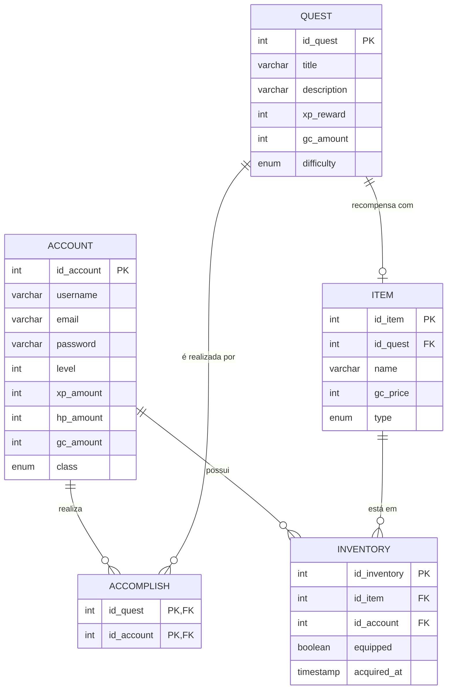

# DER Conceitual — Level-Up

Diagrama Entidade-Relacionamento conceitual do sistema Level-Up.

---

## Legenda de Cardinalidades

| Símbolo | Significado |
|---------|-------------|
| `\|\|` | Exatamente um (1,1) |
| `\|o` | Zero ou um (0,1) |
| `o{` | Zero ou muitos (0,n) |
| `\|{` | Um ou muitos (1,n) |

---

## Descrição das Entidades

### ACCOUNT
Representa o usuário do sistema. Possui atributos de RPG (level, xp, hp, gc) e uma classe escolhida no cadastro.

- `class`: GUERREIRO, MAGO, ARQUEIRO, DRUIDA

### QUEST
Missões disponíveis no sistema. Cada quest tem dificuldade e recompensas de XP e gold.

- `difficulty`: FACIL, NORMAL, DIFICIL

### ITEM
Itens disponíveis no Bazar Mágico. Um item pode ser recompensa de uma quest (Special Reward).

- `type`: PET, FUNDO, ROUPA, EFEITO

### INVENTORY
Tabela intermediária N:M entre Account e Item. Registra quais itens o usuário possui e se estão equipados.

### ACCOMPLISH
Tabela intermediária N:M entre Account e Quest. Registra quais quests o usuário completou.
