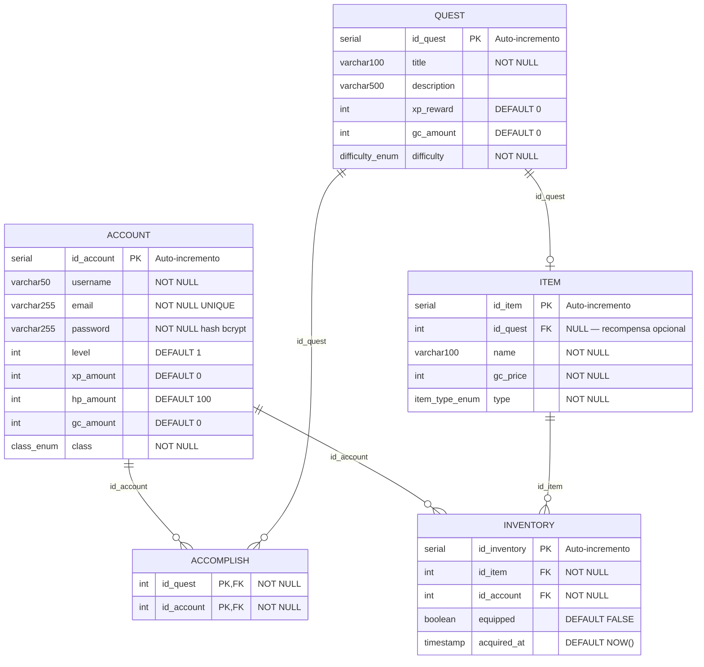

# DER Relacional — Level-Up

Diagrama Relacional com tipos de dados, chaves primárias e estrangeiras.



---

## ENUMs

```sql
CREATE TYPE class_enum AS ENUM (
    'GUERREIRO',  -- Saúde & corpo
    'MAGO',       -- Estudos & conhecimento
    'ARQUEIRO',   -- Trabalho & produtividade
    'DRUIDA'      -- Bem-estar & hábitos
);

CREATE TYPE difficulty_enum AS ENUM (
    'FACIL',
    'NORMAL',
    'DIFICIL'
);

CREATE TYPE item_type_enum AS ENUM (
    'PET',
    'FUNDO',
    'ROUPA',
    'EFEITO'
);
```

---

## Script SQL Completo

```sql
-- ─── ENUMs ───────────────────────────────────────────────────────
CREATE TYPE class_enum AS ENUM ('GUERREIRO', 'MAGO', 'ARQUEIRO', 'DRUIDA');
CREATE TYPE difficulty_enum AS ENUM ('FACIL', 'NORMAL', 'DIFICIL');
CREATE TYPE item_type_enum AS ENUM ('PET', 'FUNDO', 'ROUPA', 'EFEITO');

-- ─── TABELAS ─────────────────────────────────────────────────────

CREATE TABLE Account (
    id_account  SERIAL          PRIMARY KEY,
    username    VARCHAR(50)     NOT NULL,
    email       VARCHAR(255)    NOT NULL UNIQUE,
    password    VARCHAR(255)    NOT NULL,
    level       INT             DEFAULT 1,
    xp_amount   INT             DEFAULT 0,
    hp_amount   INT             DEFAULT 100,
    gc_amount   INT             DEFAULT 0,
    class       class_enum      NOT NULL
);

CREATE TABLE Quest (
    id_quest    SERIAL              PRIMARY KEY,
    title       VARCHAR(100)        NOT NULL,
    description VARCHAR(500),
    xp_reward   INT                 DEFAULT 0,
    gc_amount   INT                 DEFAULT 0,
    difficulty  difficulty_enum     NOT NULL
);

CREATE TABLE Item (
    id_item     SERIAL          PRIMARY KEY,
    id_quest    INT,
    name        VARCHAR(100)    NOT NULL,
    gc_price    INT             NOT NULL,
    type        item_type_enum  NOT NULL
);

CREATE TABLE Inventory (
    id_inventory    SERIAL      PRIMARY KEY,
    id_item         INT         NOT NULL,
    id_account      INT         NOT NULL,
    equipped        BOOLEAN     DEFAULT FALSE,
    acquired_at     TIMESTAMP   DEFAULT NOW()
);

CREATE TABLE Accomplish (
    id_quest    INT     NOT NULL,
    id_account  INT     NOT NULL,
    PRIMARY KEY (id_quest, id_account)
);

-- ─── FOREIGN KEYS ────────────────────────────────────────────────

ALTER TABLE Item
    ADD CONSTRAINT fk_item_quest
    FOREIGN KEY (id_quest) REFERENCES Quest (id_quest)
    ON DELETE SET NULL;

ALTER TABLE Inventory
    ADD CONSTRAINT fk_inventory_item
    FOREIGN KEY (id_item) REFERENCES Item (id_item)
    ON DELETE CASCADE;

ALTER TABLE Inventory
    ADD CONSTRAINT fk_inventory_account
    FOREIGN KEY (id_account) REFERENCES Account (id_account)
    ON DELETE CASCADE;

ALTER TABLE Accomplish
    ADD CONSTRAINT fk_accomplish_quest
    FOREIGN KEY (id_quest) REFERENCES Quest (id_quest)
    ON DELETE CASCADE;

ALTER TABLE Accomplish
    ADD CONSTRAINT fk_accomplish_account
    FOREIGN KEY (id_account) REFERENCES Account (id_account)
    ON DELETE CASCADE;

-- ─── ÍNDICES ─────────────────────────────────────────────────────

CREATE INDEX idx_inventory_account    ON Inventory(id_account);
CREATE INDEX idx_inventory_item       ON Inventory(id_item);
CREATE INDEX idx_accomplish_account   ON Accomplish(id_account);
CREATE INDEX idx_accomplish_quest     ON Accomplish(id_quest);

-- ─── SEED (dados iniciais) ────────────────────────────────────────

INSERT INTO Item (name, gc_price, type) VALUES
    ('Armadura Anciã',   200, 'ROUPA'),
    ('Casa Nova',        150, 'FUNDO'),
    ('Dragão Filhote',   500, 'PET'),
    ('Aura Mágica',      300, 'EFEITO');
```

---

## Regras de Negócio Implementadas

| Regra | Implementação |
|-------|--------------|
| Um item pode ser recompensa de no máximo uma quest | `id_quest` em Item é FK nullable (0,1) |
| Um usuário pode ter vários itens no inventário | Tabela Inventory N:M |
| Um usuário pode completar várias quests | Tabela Accomplish N:M |
| Deletar account remove inventário e conquistas | `ON DELETE CASCADE` |
| Deletar quest não deleta o item recompensa | `ON DELETE SET NULL` |
| Senhas nunca em texto plano | Hash bcrypt no backend |
